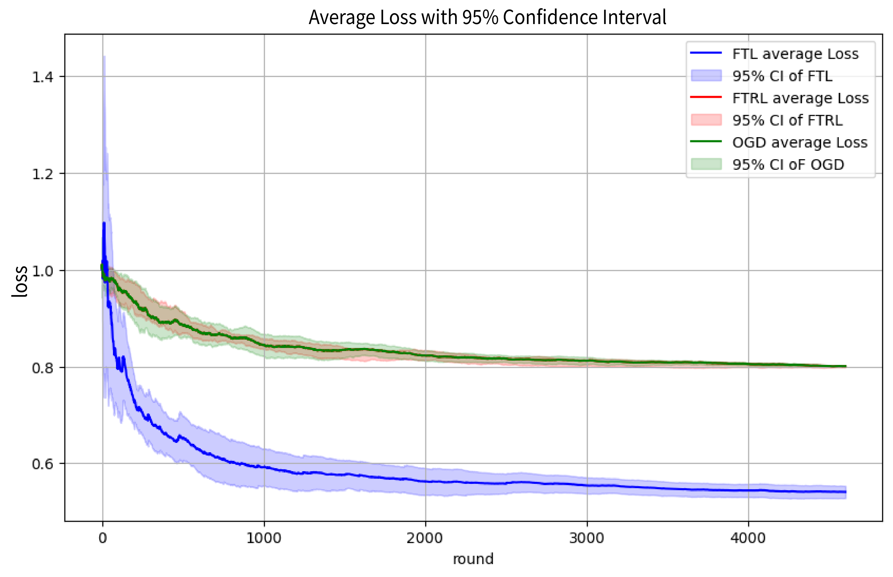
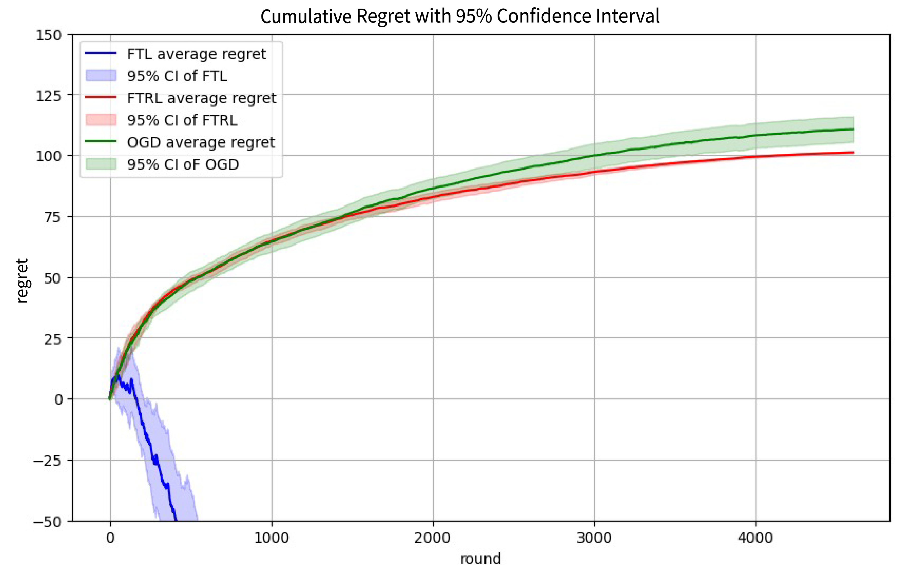

# ESTR3114 - Numerical Optimization

Course Project: First-Order Methods in Online Convex Optimization

Online convex optimization (OCO) deals with making sequential decisions in an uncertain
environment where data arrives in a streaming fashion. Hence, it is necessary, and
beneficial, to take a robust approach, by applying an optimization method that
learns as more aspects of the problem are observed. This view of optimization as a
process has led to successes in developing efficient algorithms for prominent online
learning problems. In this project, we aim to understand the key concepts in online convex
optimization, several classic first-order online convex optimization algorithms that
are robust to adversarial attacks, and showcase the applicability of the framework
to the online email classification task.

We demonstrate the potential of FTRL and OGD with the email categorization task by utilizing
a soft-margin linear SVM with hinge loss. Specifically, we have trained a online learning model 
on the ``Spambase`` (``spam_data.mat``) dataset adapted from the UCI Machine Learning Repository 
containing 4601 emails, each represented by 57 features. We then verified the theoretical regret bound
$BL\sqrt{2T}$ with an asymptotically sublinear growth for both FTRL and OGD. See the figures below for
more details.

